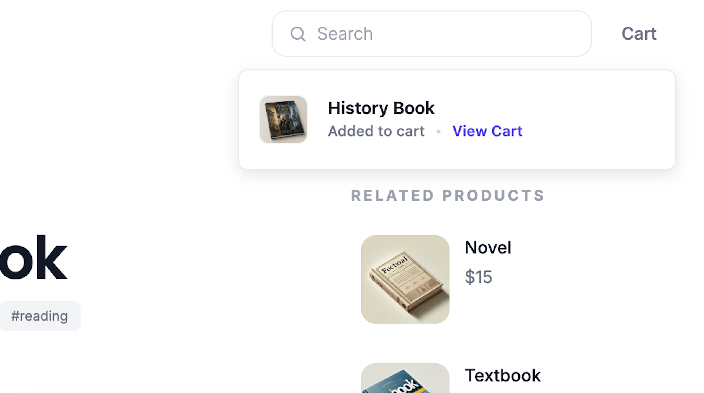
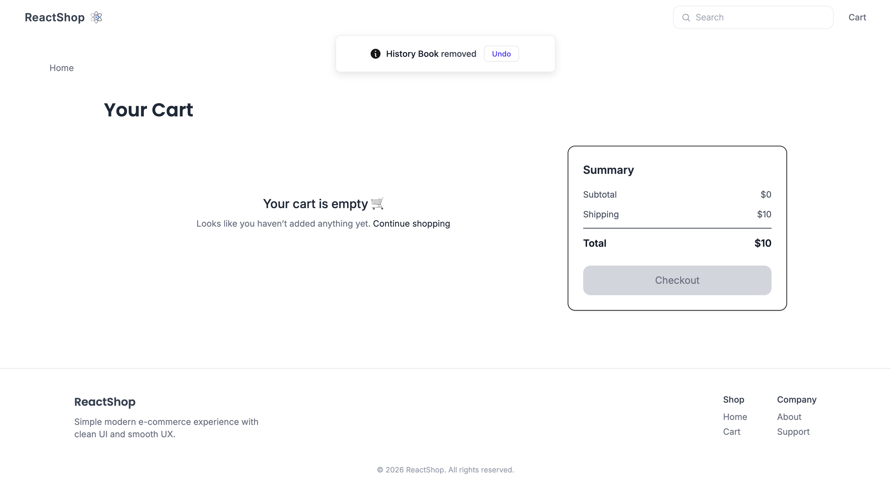
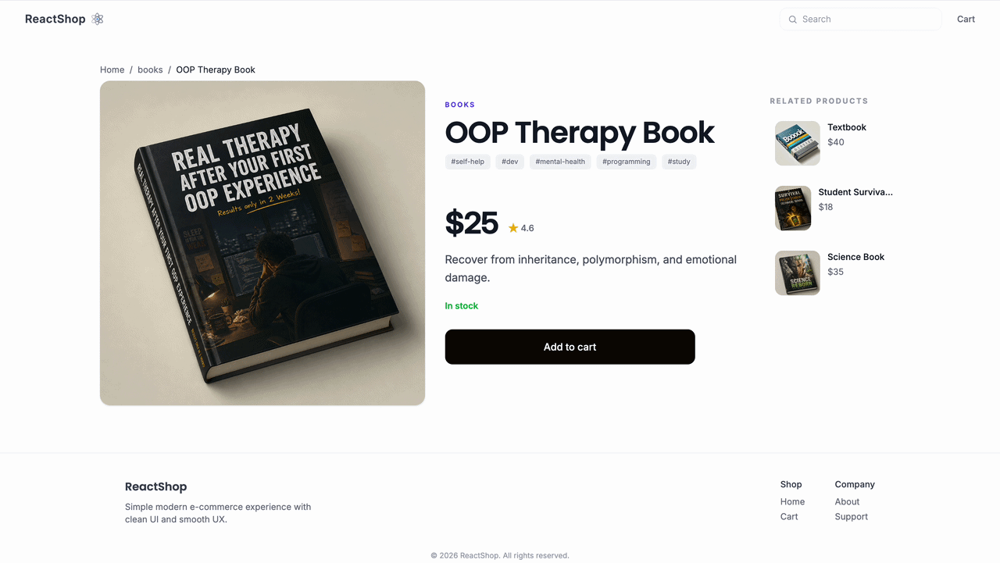
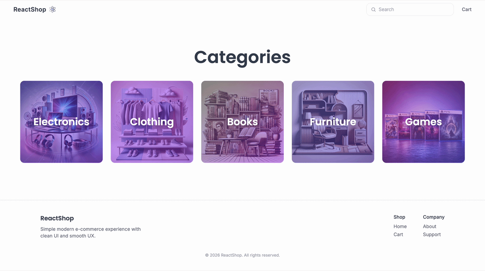

# 🛍️ ReactShop 

A minimalist boutique storefront built with React and TypeScript, focused on clean state management, reusable components, and polished UX interactions.

---

🎬 Preview

<p align="center"> 
  
</p>

---

## 🚀 Features

* **Product Catalog** with category filtering and sorting by price.
* **Product Details** with a dynamically calculated "Related Products" list.
* **Shopping Cart** built with React Context + `useReducer`, including an "Undo" action for deleted items.
* **Search System** integrated with URL query parameters.
* **Loading Skeletons** using Tailwind's `animate-pulse` for better UX.
* **Error & Empty States** handling (broken image fallbacks, network errors, no search results found).

---

## 🧠 Tech Stack

* **Frontend:** React, TypeScript, Vite
* **Styling:** Tailwind CSS
* **Routing:** React Router DOM
* **UI Components:** Sonner (Toasts)

---
## 🌐 Live Demo

👉 [ReactShop Live](https://vite-react-ecommerce-jet.vercel.app/) 

---

## 🧩 Architecture & Decisions

### ❗ Problem: Lack of Cart Feedback

Adding or removing items from the cart initially provided no visual confirmation. 
This made interactions feel unclear, especially when removing products accidentally.

### ✅ Solution: Reducer-Based Cart State with Undo Support

Integrated Sonner toast notifications directly with a centralized cart state powered by `useReducer` and React Context to handle mutation feedback.

#### 📦 1. Seamless Item Addition
Adding a product instantly triggers a confirmation toast with a deep-link shortcut to the cart page.
<p align="center">
  
</p>

#### ⏳ 2. Undo Rollback
Removing a product creates a temporary state snapshot, allowing the reducer to restore items through a dedicated `RESTORE_ITEM` action.

<p align="center">
  
</p>

---

### ❗ Problem: Limited Product Search

A basic title-only search made it difficult to locate products using tags, categories, descriptions, or exact product IDs.

### ✅ Solution: Multi-Field Search Utility

Implemented a reusable filtering utility supporting:
* Product titles and descriptions
* Category identifiers
* Nested product tags
* Exact product ID matching

```ts
const filtered = products.filter(
  (product) =>
    product.title.toLowerCase().includes(normalizedQuery) ||
    product.tags.some((tag) => tag.includes(normalizedQuery)) ||
    product.description.toLowerCase().includes(normalizedQuery) ||
    product.categoryId.toLowerCase().includes(normalizedQuery) ||
    String(product.id) === query,
);
```

👉 This [filterProducts function](https://github.com/KIB101D/vite-react-ecommerce/blob/main/src/utils/filterProducts.ts) approach allows users to search products more flexibly instead of relying only on exact title matches.

---

### ❗ Problem: Blank Loading States

Although local JSON loading is nearly instant, real API requests can introduce noticeable delays.
Using a full-page spinner felt visually disruptive and caused layout jumps.

### ✅ Solution: Skeleton Loading Screens

Created reusable loading skeletons using Tailwind’s `animate-pulse` utility for the Home and Product pages.

<table align="center">
  <tr>
    <td align="center">
       
      <br />
    </td>
    <td align="center">
      
      <br />
    </td>
  </tr>
</table>

💡 Instead of blocking the interface, the skeletons preserve the layout structure while data is loading, improving perceived responsiveness and keeping the UI visually stable.

---

## 📦 Installation 

```bash
npm install
npm run dev
```
